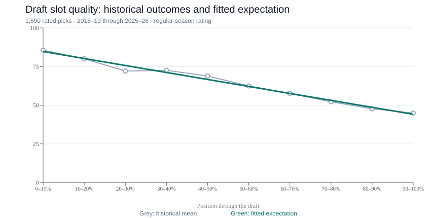

# Historical draft-slot quality

The league's stored draft results support a smooth, nearly linear decline in
expected regular-season rating across the draft. The selected benchmark is:

```text
share = (lastNonSigningPick - pick + 1) / lastNonSigningPick
expectedRating = 41.73092969231692 + 45.19453675621042 * share
valueOverSlot = playerRegularSeasonRating - expectedRating
```

Use the largest numbered non-signing pick in that season, including unselected
slots. Signing rows never define the comparison cohort or receive slot grades.
Missing player outcomes remain missing. This is a retrospective league benchmark,
not a promise about an individual player. All positions share the benchmark because
the outcome is the existing position-normalized `PlayerTotalStatLine.Rating`.
The stored-data definitions and rating pool behavior are owned by
[schema.ts](../../convex/schema.ts) and [RANKING.md](../RANKING.md).

## Primary source and coverage

Read-only queries inspected all 16 configured seasons on production
`https://polished-tern-709.convex.cloud` on 2026-09-21 Toronto time
(`2026-09-22T01:01:03.388Z`). Inputs were `Season`,
`DraftPick`, and season-bounded `PlayerTotalStatLine`, `PlayerSplitStatLine`,
`PlayerNHLStatLine`, and `TeamSeasonStatLine` records, accessed through the existing
[Convex store integration](../../scripts/src/integrations/data/convex-store.ts).
Canonical season/player IDs joined picks to `RS` total rows. No player names,
credentials, authentication headers, or user records were needed.

The reproducible collector is
[research-slot-curve.ts](../../scripts/src/commands/draft/research-slot-curve.ts);
its pure analysis is
[draft-slot-research.ts](../../scripts/src/domains/ranking/draft-slot-research.ts).
Local source and observations are in
`.local-data/draft-slot-research/source.json` and `analysis.json` (not committed).
Source SHA-256:
`6efe2230f7b9b37a51a5d9bc882cb3433248fdfbd9e21d8fe00fff84c5400489`.

| Season  | Stored picks | Signings | Selected non-signings | Last non-signing slot | Rated selections | Missing RS ratings |
| ------- | -----------: | -------: | --------------------: | --------------------: | ---------------: | -----------------: |
| 2013-14 |            0 |        0 |                     0 |                     — |                0 |                  0 |
| 2014-15 |            0 |        0 |                     0 |                     — |                0 |                  0 |
| 2015-16 |            0 |        0 |                     0 |                     — |                0 |                  0 |
| 2016-17 |            0 |        0 |                     0 |                     — |                0 |                  0 |
| 2017-18 |            0 |        0 |                     0 |                     — |                0 |                  0 |
| 2018-19 |          240 |        1 |                   239 |                   240 |              238 |                  1 |
| 2019-20 |          240 |        1 |                   239 |                   240 |              236 |                  3 |
| 2020-21 |          240 |        0 |                   240 |                   240 |              240 |                  0 |
| 2021-22 |          240 |       48 |                   192 |                   192 |              192 |                  0 |
| 2022-23 |          240 |       49 |                   191 |                   203 |              191 |                  0 |
| 2023-24 |          240 |       62 |                   178 |                   194 |              177 |                  1 |
| 2024-25 |          210 |       50 |                   160 |                   182 |              158 |                  2 |
| 2025-26 |          210 |       52 |                   158 |                   176 |              158 |                  0 |
| 2026-27 |          210 |       47 |                   163 |                   174 |                0 |                163 |
| 2027-28 |          210 |       40 |                     0 |                     — |                0 |                  0 |
| 2028-29 |            0 |        0 |                     0 |                     — |                0 |                  0 |

The fitting cohort contains **1,590 observed selections in eight completed
seasons**, excluding seven unavailable outcomes. The first five seasons have no
stored draft picks; their historical drafts cannot be reconstructed from these
tables. Future seasons were inspected but excluded. Completion uses the season
end date relative to collection time: 2025-26 still has a stale `isActive` flag,
although its end date is past. There were no duplicate RS player totals in any
season. Signings can occur within the numbered draft, explaining why the number
of selected non-signings is sometimes smaller than its last slot. These findings
are produced directly by the linked research command.

## Model selection and validation

Each selection receives equal weight. Least squares estimates a floor and a
nonnegative span; this enforces decreasing expectations as picks get later.
Candidate normalized powers ranged from 0.1 to 10 in steps of 0.1. Absolute-pick
exponential decay scales ranged from 2 to 300 in steps of 2; logarithmic decay was
also evaluated. Every leave-one-season-out fold refitted its coefficients and,
for the flexible families, its shape using only the other seven seasons. This
keeps an entire season out of training rather than scattering its picks across
training and validation. The family comparisons below come from the
[pure fitting implementation](../../scripts/src/domains/ranking/draft-slot-research.ts).

| Benchmark                                                       |   RMSE | Mean absolute error | Mean prediction minus outcome |
| --------------------------------------------------------------- | -----: | ------------------: | ----------------------------: |
| Selected normalized linear, held-out seasons                    | 18.713 |              14.891 |                        -0.036 |
| Normalized power with shape refitted, held-out seasons          | 18.737 |              14.905 |                        -0.036 |
| Absolute-pick exponential, held-out seasons                     | 19.169 |              15.310 |                        -0.118 |
| Absolute-pick logarithm, held-out seasons                       | 19.608 |              15.747 |                        -0.058 |
| Previous season-min/max power 1.35, evaluated in its own season | 31.140 |              24.891 |                       -18.567 |

The old baseline is deliberately labeled in-season: it uses that season's outcome
minimum/maximum and cannot be treated as a held-out forecast. Despite this access
to the outcomes, it substantially underestimates the middle and late draft.
The new fixed linear curve reduces observed RMSE by about 40% relative to that
baseline. The fully fitted power is exactly 1.0 on the tested grid, favoring the
simpler linear model rather than a more complex curve.

A separate temporal check trains on 2018-19 through 2023-24 and tests the latest
two seasons (316 selections). It selects power 1.0, floor 42.25819823744194 and span
44.26074037523842, yielding RMSE **17.509**, MAE **13.876**, and bias **+0.205**.
The final published coefficients refit all eight seasons. This is validation
against historical ratings as stored today; it is not a reconstruction of what
ratings were available on each original draft day.

## Observed shape



Bands below use `(pick - 1) / lastNonSigningPick`. Predictions average the fitted
curve at the actual observed slots in each band, not just the band midpoint.
These are descriptive checks on the full fitting cohort, not held-out errors.

| Draft-depth band | Picks | Mean actual RS rating | Mean expected rating |
| ---------------- | ----: | --------------------: | -------------------: |
| First 10%        |   170 |                 85.58 |                84.73 |
| 10-20%           |   166 |                 80.06 |                80.17 |
| 20-30%           |   166 |                 72.08 |                75.67 |
| 30-40%           |   166 |                 72.59 |                71.16 |
| 40-50%           |   163 |                 68.90 |                66.64 |
| 50-60%           |   168 |                 62.44 |                62.13 |
| 60-70%           |   165 |                 57.58 |                57.58 |
| 70-80%           |   160 |                 52.22 |                53.11 |
| 80-90%           |   149 |                 47.67 |                48.61 |
| Final 10%        |   117 |                 44.95 |                44.13 |

For a season whose last non-signing slot is 176, picks 1, 28, 56, 84, 112, 140,
and 176 expect approximately **86.9, 80.0, 72.8, 65.6, 58.4, 51.2, and 42.0**.
Individual outcomes still vary widely (roughly 19 rating points RMSE), so slot
differences are expectations over many selections. Shortened seasons and changing
keeper availability remain represented in the historical cohort. Future major
format changes should trigger another calibration review.

## Draft page and Calder

The draft page's overall outcome and value over slot should use the same RS total
rating basis. Team roster days and total roster usage communicate retention
separately, avoiding comparisons between different split/total rating formulas.

Calder's former slot component compared prior NHL `overallRating` to a within-draft
min/max curve, while the page compared GSHL RS production. Applying the empirically
fitted GSHL outcome curve directly to prior NHL talent would mix incompatible
scales. Therefore the slot-surplus component now compares actual RS total rating
to this same RS expectation; existing current-NHL, RS-total, team-contribution and
team aggregation weights remain owned by the
[Calder runtime](../../scripts/src/runtime/RankingEngine/index.js).
This changes the interpretation of that component from prior-talent selection to
realized value over slot. Picks with missing RS ratings must not acquire a zero
outcome or a fabricated surplus. Seasons with no recorded draft cannot acquire
new evidence-based Calder grades from this research.

The coefficient source is
[RankingEngine/config.js](../../scripts/src/runtime/RankingEngine/config.js),
with the browser artifact synchronized by
[sync-draft-slot.mjs](../../tools/sync-draft-slot.mjs). The runtime and browser
must remain mathematically identical. Historical recalculation is a separate
authorized operation; this research command performs no production mutations.
